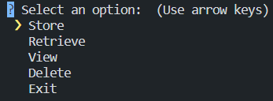

# Locus

Locus is a Secure Data Management System that allows you to store, retrieve, view, and delete sensitive information securely. It provides a command-line interface for managing your data with encryption and password protection.

## Installation Guide

Before using, make sure you have the following prerequisites installed:

- Python 3.6 or higher
- PIP (only for Python versions lower than 3.4. PIP comes with Python 3.4 or higher )
- (**_optional_**) OpenSSL (key generation for encryption). [Visit here to download](https://www.openssl.org/source/)

Follow these steps to set up and run the system:

1. Clone this repository to your local machine:
   ```
   git clone https://github.com/Rahul-jpeg/Locus.git
   cd locus
   ```
2. Install the required python libraries:
   ```
   pip install -r requirements.txt
   ```
3. Generate a secret key for encryption (_copy the generated token_):

   `openssl rand -base64 32` - _OpenSSL_

   **OR**

   Create a `temp.py` file, paste the following code and run it.

   ```
   from secrets import token_bytes
   from base64 import b64encode
   print(b64encode(token_bytes(32)).decode())
   ```

4. Create a `.env` file in the project directory and add the generated token. You can generate a secret key and add it to the `.env` file as follows:

   `echo "SECRET=your_secret_key_here" > .env`

> _replace "your_secret_key_here" with the copied token_

5.  Create a empty `data.bin` file in the project directory (_for storing the binary data_)

6.  Run the program:
    ```
    python locus.py
    ```

## Working

When the program is run, you'll be shown the following menu in the command-line interface:



### Store

To store sensitive information, follow these steps:

1.  Select the "Store" option from the main menu.
2.  Enter a label for your data (e.g., "Password for Email").
3.  Enter the value or sensitive information (e.g., your email password). Your input will be masked for security.
4.  Choose a unique 3-character key to identify this data. Ensure that the key is alphanumeric and in uppercase (e.g., "ABC" or "AB1").
5.  Your data will be encrypted and securely stored.

### Retrieve

To retrieve stored data, follow these steps:

1.  Select the "Retrieve" option from the main menu.
2.  Enter the 3-character key associated with the data you want to retrieve.
3.  The system will decrypt and display the label and value associated with the key.

### View

To view all stored data in an HTML file, follow these steps:

1.  Select the "View" option from the main menu.
2.  The system will generate an HTML file (`data.html`) containing a list of all stored data.
3.  The HTML file is hosted on `localhost:6001`. You can access it using a web browser.

### Delete

To delete stored data, follow these steps:

1.  Select the "Delete" option from the main menu.
2.  Enter the 3-character key associated with the data you want to delete.
3.  The data will be permanently removed from the system.

## Exit

1. Select the "Exit" option to exit from the process

Please ensure that you remember your secret key (used for encryption and decryption) as it's crucial for securely managing your data. If you lose the secret key, you won't be able to retrieve or view your stored information.